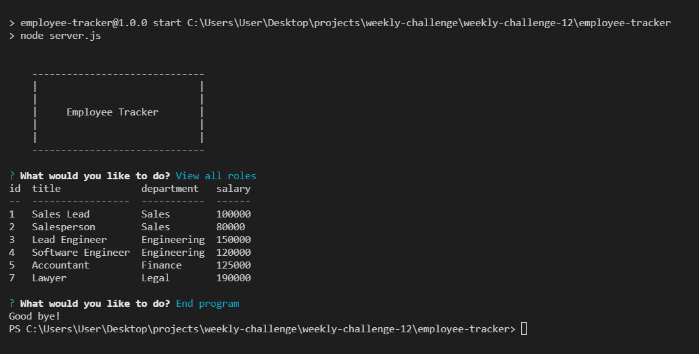
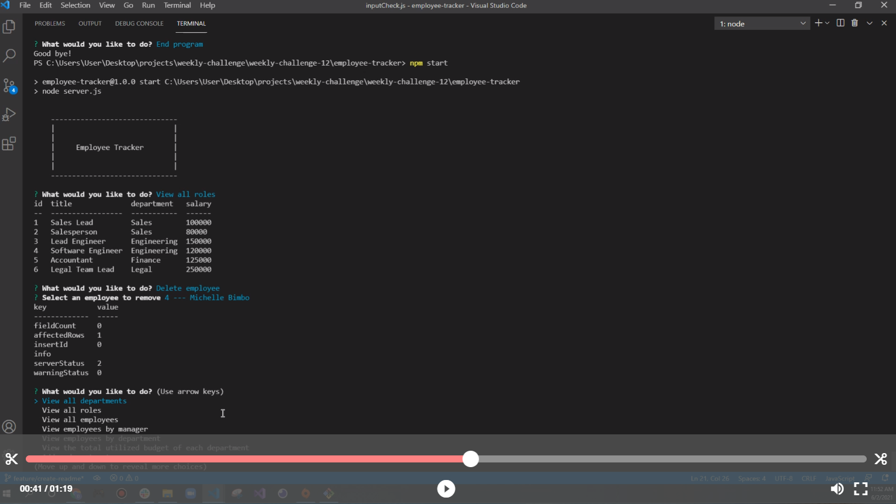

# Employee Tracker

## Description 

  Employee Tracker enables users to view and manage the departments, roles, and employees of their company so that they can organize and plan their business. Node.js, inquirer library and console table f were used to accomplish this task.

  
 
## Installation

  - Clone/Download the project
  - Run 'npm install' in the root directory
  
## Usage 
  
  - For clarity, watch the videos below for a quick tutorial on how to use the application:
    - Video 1: https://drive.google.com/file/d/1-5XQtUxkmt3caAVBtst0L7pm8HJTjaYZ/view
    - Video 2: https://drive.google.com/file/d/1zFcEiL-xrdGNACIoFVnxiMc54dQcTHNK/view
  

  
## Questions
  - 👋 Hi, I’m dkbaffour777
  - GitHub profile link: [github.com/dkbaffour777/](https://github.com/dkbaffour777/)
  - 📫 How to reach, email: dkbaffour777@gmail.com
